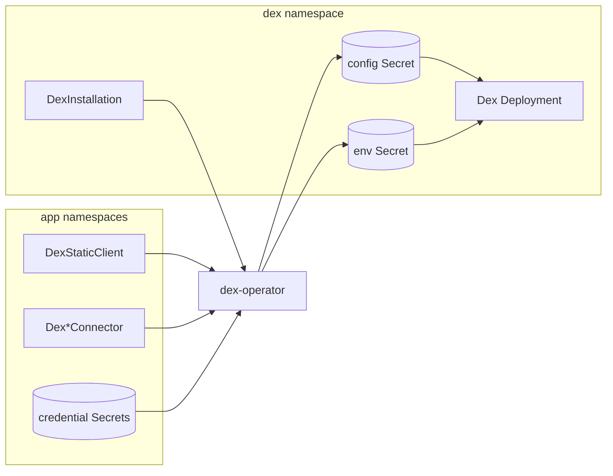

# dex-operator

[](https://github.com/guided-traffic/dex-operator/actions)
[](https://github.com/guided-traffic/dex-operator)
[](https://goreportcard.com/report/github.com/guided-traffic/dex-operator)
[](LICENSE)

A Kubernetes operator (Go, [controller-runtime](https://github.com/kubernetes-sigs/controller-runtime)) that assembles the configuration of [Dex](https://dexidp.io/) dynamically from Custom Resources.

Dex itself keeps being installed via the official [Dex Helm chart](https://github.com/dexidp/helm-charts). The operator watches Custom Resources across the cluster and renders two Secrets into the Dex namespace:

- **Config Secret** — the complete Dex `config.yaml` (issuer, storage, web, gRPC, logger, expiry, connectors, static clients)
- **Env Secret** — all credentials as environment variables (e.g. `GRAFANA_CLIENT_SECRET`), attached to the Dex container via `envFrom` and referenced from the config as `$VAR` / `secretEnv`



## ✨ Key Features

- 🧩 **Declarative Dex configuration** — 18 namespace-scoped CRDs under `dex.gtrfc.com/v1`; no hand-written `config.yaml`
- 🔌 **16 connector types** — LDAP, OIDC, SAML, GitHub, GitLab, Google, Microsoft, and more, each with its own strongly-typed CRD
- 🔐 **No secrets in Custom Resources** — credentials stay in Kubernetes Secrets and are referenced by name/key; client secrets are injected into Dex as environment variables, never written in plaintext into the rendered config
- 🏢 **Multi-tenant by design** — apps register their own OAuth2 clients and connectors from their own namespaces; a per-installation namespace allowlist controls who may contribute
- 🚦 **Public (PKCE) and confidential clients** — secretless static clients for CLIs/SPAs, validated at admission time via CEL rules (no webhook needed)
- 🔁 **Live reconfiguration** — changes to any CR or referenced Secret re-render the config; optional automatic rollout restart of the Dex Deployment
- 👀 **Secret rotation aware** — the operator watches referenced Secrets and reacts to credential rotations automatically
- 🧮 **Deterministic output** — stable ordering and semantic YAML comparison prevent restart loops and config churn
- 📊 **Operational visibility** — `Ready` conditions, connector/client counts, and `kubectl get` print columns on every resource
- 📦 **Helm installation** — including a pre-upgrade hook job that keeps CRDs up to date

## 📛 Naming Conventions

Everything the operator generates follows deterministic naming rules. Knowing them makes debugging and Secret handling predictable.

### Resources

| Convention | Rule |
|---|---|
| API group / version | `dex.gtrfc.com/v1`, all CRDs **namespace-scoped** |
| Connector CRDs | `Dex<Provider>Connector`, e.g. `DexOIDCConnector`, `DexLDAPConnector` |
| Connector ID | `spec.id`, falling back to `metadata.name`. The ID appears in Dex login URLs and in generated env var names |
| Installation reference | Every connector and client points to its installation via `spec.installationRef` (`name` + `namespace`) |

`kubectl` short names: `dexinst`, `dexsc`, `dexldap`, `dexgithub`, `dexsaml`, `dexgitlab`, `dexoidc`, `dexoauth2`, `dexgoogle`, `dexlinkedin`, `dexmicrosoft`, `dexauthproxy`, `dexbitbucket`, `dexlocal`, `dexopenshift`, `dexcrowd`, `dexgitea`, `dexkeystone`.

### Generated environment variables

Credentials are materialized in the env Secret under deterministic names. Names are uppercased and every non-alphanumeric character becomes `_`:

| Source | Pattern | Example |
|---|---|---|
| Connector client secret | `<TYPE>_<ID>_CLIENT_SECRET` | `OIDC_KEYCLOAK_CLIENT_SECRET` |
| LDAP bind password | `LDAP_<ID>_BIND_PW` | `LDAP_CORPORATE_LDAP_BIND_PW` |
| Keystone admin password | `KEYSTONE_<ID>_PASSWORD` | `KEYSTONE_OPENSTACK_PASSWORD` |
| Storage password | `STORAGE_<BACKEND>_PASSWORD` | `STORAGE_POSTGRES_PASSWORD` |
| Static client secret | `<RESOURCE_NAME>_CLIENT_SECRET` | `GRAFANA_CLIENT_SECRET` (from a `DexStaticClient` named `grafana`) |

Two `DexStaticClient` resources whose names sanitize to the same env var (e.g. `my-app` and `my.app`) are rejected with a collision error at build time.

### Secret keys and file paths

| Convention | Rule |
|---|---|
| Static client Secret keys | `client-id` / `client-secret` (overridable via `secretRef.clientIDKey` / `secretRef.clientSecretKey`) |
| Config Secret content | single key `config.yaml` |
| Managed Secret labels | `app.kubernetes.io/managed-by: dex-operator`, `dex.gtrfc.com/installation: <name>` |
| Derived CORS origin | `scheme://host[:port]` of every **https** `redirectURIs` entry of a `DexStaticClient` with `cors: true` — host lowercased, a redundant `:443` dropped (e.g. `https://dtrack.example.com/static/cb.html` → `https://dtrack.example.com`) |
| Connector cert files | `/etc/dex/certs/<connector-id>-<field>.pem` (e.g. `-root-ca`, `-client-cert`, `-client-key`, `-ca`) |
| Google service account | `/etc/dex/secrets/<connector-id>-service-account.json` |
| Storage TLS files | `/etc/dex/certs/postgres-*.pem`, `etcd-*.pem`, `mysql-*.pem` |

> **Note:** file-based references (SAML CA, client TLS certs, service-account JSON, storage TLS) are rendered into the config at the paths above, but mounting those files into the Dex Pod is currently **not automated** — add the volumes/volumeMounts in your Dex Helm values. Inline-capable material (LDAP `rootCAData`) is embedded base64-encoded and needs no mount.

## 📚 Documentation

| Document | Content |
|---|---|
| [DEVELOPER.md](DEVELOPER.md) | Repository layout, packages and their responsibilities, reconciliation flow, how to add a connector type, test & release workflow |
| [SECURITY_ARCHITECTURE.md](SECURITY_ARCHITECTURE.md) | In-depth security architecture: trust boundaries, secret flow, namespace isolation, RBAC footprint, residual risks |
| [Custom Resource Reference](#-custom-resource-reference) | Every CRD with a fully populated example |
| [Dex documentation](https://dexidp.io/docs/) | Upstream semantics of all connector and OAuth2 options |

## 🚀 TL;DR — Fast Start

### 1. Install the operator

```bash
helm repo add dex-operator https://guided-traffic.github.io/dex-operator
helm repo update

helm install dex-operator dex-operator/dex-operator \
  --namespace dex-operator-system \
  --create-namespace
```

### 2. Install Dex (official chart, wired to the operator)

Dex must read the operator-generated Secrets instead of an inline config. Minimal working `dex-values.yaml`:

```yaml
# dex-values.yaml
configSecret:
  create: false
  name: dex-config        # must match DexInstallation .spec.configSecretName
envFrom:
  - secretRef:
      name: dex-env       # must match DexInstallation .spec.envSecretName
```

```bash
helm repo add dex https://charts.dexidp.io
helm repo update

helm install dex dex/dex \
  --namespace dex \
  --create-namespace \
  --values dex-values.yaml
```

> The env Secret is created by the operator once a `DexInstallation` exists. On first install, create the `DexInstallation` (step 3) before or right after installing Dex so the referenced Secrets exist.

### 3. Minimal DexInstallation

```yaml
apiVersion: dex.gtrfc.com/v1
kind: DexInstallation
metadata:
  name: main
  namespace: dex
spec:
  issuer: https://dex.example.com
  storage:
    type: kubernetes
  configSecretName: dex-config
  envSecretName: dex-env
  allowedNamespaces: ["*"]
  rolloutRestart:
    enabled: true
    deploymentName: dex
```

### 4. Minimal static clients

Confidential client (with client secret) — for server-side apps like Grafana:

```yaml
apiVersion: v1
kind: Secret
metadata:
  name: grafana-oidc
  namespace: monitoring
type: Opaque
stringData:
  client-id: grafana
  client-secret: change-me
---
apiVersion: dex.gtrfc.com/v1
kind: DexStaticClient
metadata:
  name: grafana
  namespace: monitoring
spec:
  installationRef:
    name: main
    namespace: dex
  displayName: Grafana
  secretRef:
    name: grafana-oidc
  redirectURIs:
    - https://grafana.example.com/login/generic_oauth
```

Public client (no secret, PKCE) — for CLIs, native apps, SPAs:

```yaml
apiVersion: dex.gtrfc.com/v1
kind: DexStaticClient
metadata:
  name: my-cli
  namespace: monitoring
spec:
  installationRef:
    name: main
    namespace: dex
  displayName: My CLI
  public: true
  clientID: my-cli
  # redirectURIs omitted: Dex accepts loopback, OOB and device-flow defaults
```

### 5. Minimal upstream IdP: Keycloak

Keycloak is a standard OIDC provider, so it plugs in via `DexOIDCConnector`. In Keycloak, create a confidential client (e.g. `dex`) with redirect URI `https://dex.example.com/callback`, then:

```yaml
apiVersion: v1
kind: Secret
metadata:
  name: keycloak-oidc
  namespace: dex
type: Opaque
stringData:
  client-id: dex
  client-secret: keycloak-client-secret
---
apiVersion: dex.gtrfc.com/v1
kind: DexOIDCConnector
metadata:
  name: keycloak
  namespace: dex
spec:
  installationRef:
    name: main
    namespace: dex
  displayName: Keycloak
  issuer: https://keycloak.example.com/realms/my-realm
  clientIDRef:
    name: keycloak-oidc
    key: client-id
  clientSecretRef:
    name: keycloak-oidc
    key: client-secret
  redirectURI: https://dex.example.com/callback
```

### Verify

```bash
kubectl get dexinstallation -n dex
# NAME   ISSUER                    STORAGE      CONNECTORS   CLIENTS   READY   AGE
# main   https://dex.example.com   kubernetes   1            2         True    1m

kubectl get secret dex-config dex-env -n dex
```

<details>
<summary>Upgrade / Uninstall</summary>

```bash
# Upgrade (CRDs are updated automatically by a pre-upgrade hook job)
helm repo update
helm upgrade dex-operator dex-operator/dex-operator \
  --namespace dex-operator-system

# Uninstall
helm uninstall dex-operator --namespace dex-operator-system
```

</details>

## 📖 Custom Resource Reference

Shared concepts for all resources:

- **`installationRef`** — every connector and static client references exactly one `DexInstallation` by `name` + `namespace`. Resources from namespaces not covered by that installation's `allowedNamespaces` are ignored and marked with an error condition.
- **`id`** (connectors) — the Dex connector ID; defaults to `metadata.name`.
- **`displayName`** — the human-readable name shown on the Dex login/approval screen.
- **`*Ref` fields** — `{name, key}` references to Kubernetes Secrets **in the same namespace** as the referencing resource.
- **Status** — all resources report a `Ready` condition and `observedGeneration`.

The examples below are maximally populated. Fields are set to their **default** where one exists; otherwise a realistic **example** value is shown. Security-relevant fields carry a short note — absence of a note means the field has no direct security impact.

### DexInstallation

The global Dex configuration. One `DexInstallation` corresponds to one Dex deployment.

```yaml
apiVersion: dex.gtrfc.com/v1
kind: DexInstallation
metadata:
  name: main
  namespace: dex
spec:
  # ── Core ──────────────────────────────────────────────────────────────
  # Trust anchor of your SSO: the value baked into every issued token.
  # Must be the exact HTTPS URL clients use to reach Dex; changing it
  # invalidates all existing tokens. (required)
  issuer: https://dex.example.com

  # ── Storage (required) ────────────────────────────────────────────────
  # type: kubernetes | memory | postgres | sqlite3 | etcd | mysql
  # "kubernetes" (CRD-based) needs no credentials. "memory" loses all
  # sessions/refresh tokens on restart — dev only.
  storage:
    type: postgres                    # example (simplest choice: kubernetes)
    postgres:
      host: postgres.db.svc:5432      # example
      database: dex                   # example
      user: dex                       # example
      passwordRef:                    # password never appears in this CR or in
        name: dex-postgres            # the rendered config; it is injected as
        key: password                 # env var STORAGE_POSTGRES_PASSWORD
      ssl:
        # Security: "disable" sends credentials and tokens in cleartext to the
        # DB; use verify-ca/verify-full in production.
        mode: verify-full             # example (disable|require|verify-ca|verify-full)
        caRef:   { name: dex-postgres-tls, key: ca.crt }      # → /etc/dex/certs/postgres-ca.pem
        certRef: { name: dex-postgres-tls, key: tls.crt }     # → /etc/dex/certs/postgres-client-cert.pem
        keyRef:  { name: dex-postgres-tls, key: tls.key }     # → /etc/dex/certs/postgres-client-key.pem
      connectionTimeout: 5            # seconds, example
      maxOpenConns: 5                 # example
      maxIdleConns: 5                 # example
      connMaxLifetime: 300            # seconds, example
    # Other backends (mutually exclusive with postgres):
    # sqlite3: { file: /var/dex/dex.db }
    # etcd:
    #   endpoints: ["https://etcd-0:2379"]
    #   namespace: dex/
    #   username: dex
    #   passwordRef: { name: dex-etcd, key: password }
    #   ssl: { serverName: etcd, caRef: {...}, certRef: {...}, keyRef: {...} }
    # mysql: same shape as postgres (password env: STORAGE_MYSQL_PASSWORD)

  # ── HTTP endpoints ────────────────────────────────────────────────────
  web:
    http: 0.0.0.0:5556                # default in the Dex chart
    https: 0.0.0.0:5554               # example; requires tlsCert/tlsKey
    tlsCert: /etc/dex/tls/tls.crt     # example (file must be mounted into Dex)
    tlsKey: /etc/dex/tls/tls.key      # example
    # Security (CORS): only list origins that must call Dex from the browser
    # (e.g. SPAs using PKCE). "*" would allow any website to probe Dex.
    # Browser clients can instead self-register via DexStaticClient.spec.cors;
    # this list stays as the base and escape hatch. The rendered list is this
    # list, in order, plus the derived origins appended and sorted.
    allowedOrigins:
      - https://app.example.com       # example
    allowedHeaders:
      - Authorization                 # example

  # ── gRPC API (optional; used for dynamic client management) ───────────
  grpc:
    addr: 0.0.0.0:5557                # example
    # Security: the gRPC API can create/modify OAuth2 clients. Always front
    # it with mTLS (tlsClientCA) and never expose it outside the cluster.
    tlsCert: /etc/dex/grpc/tls.crt    # example
    tlsKey: /etc/dex/grpc/tls.key     # example
    tlsClientCA: /etc/dex/grpc/ca.crt # example — enables client-cert auth
    reflection: false                 # default

  # ── Logging ───────────────────────────────────────────────────────────
  logger:
    level: info                       # default (debug|info|warning|error)
    format: text                      # default (text|json)

  # ── Token lifetimes ───────────────────────────────────────────────────
  expiry:
    signingKeys: 6h                   # Dex default — rotation of JWT signing keys
    idTokens: 24h                     # Dex default — shorter = faster credential
                                      # revocation, more re-authentication
    authRequests: 24h                 # Dex default
    deviceRequests: 5m                # Dex default
    refreshTokens:
      # Security: refresh tokens are long-lived credentials. Rotation +
      # inactivity windows bound the damage of a stolen token.
      disableRotation: false          # default — keep rotation on
      reuseInterval: 3s               # example — tolerates concurrent refreshes
      validIfNotUsedFor: 2160h        # example (90 days of inactivity)
      absoluteLifetime: 3960h         # example (hard cap ~165 days)

  # ── OAuth2 behaviour ──────────────────────────────────────────────────
  oauth2:
    responseTypes: ["code"]           # default — the code flow; avoid enabling
                                      # implicit ("token") flows unless required
    # Security: the approval screen is the user's chance to see which client
    # requests access. Skipping it is fine when all clients are first-party.
    skipApprovalScreen: false         # default
    alwaysShowLoginScreen: false      # default
    grantTypes: ["authorization_code", "refresh_token"]  # example (default: all supported)
    # Security: enables the password grant against this connector — user
    # credentials pass through the client. Leave unset unless a legacy
    # client truly needs it.
    passwordConnector: local          # example

  # ── Login UI ──────────────────────────────────────────────────────────
  frontend:
    dir: /srv/dex/web                 # example — custom web assets
    theme: dark                       # example
    issuer: Example Corp SSO          # example — display name on the login page
    logoURL: https://example.com/logo.svg  # example

  # ── Operator wiring ───────────────────────────────────────────────────
  configSecretName: dex-config        # required — Secret receiving config.yaml
  envSecretName: dex-env              # required — Secret receiving all env vars

  # Security: THE central tenancy control. Only connectors/clients from these
  # namespaces are included. Empty/omitted = deny all. "*" = allow every
  # namespace — combine with RBAC on the CRDs (see SECURITY_ARCHITECTURE.md).
  allowedNamespaces:
    - monitoring                      # example
    - team-a                          # example

  rolloutRestart:
    enabled: true                     # example (default: false) — restart Dex
    deploymentName: dex               # when config.yaml changes so file-based
                                      # config is re-read immediately
```

### DexStaticClient

An OAuth2 client registered with Dex. Two modes exist, and the difference matters for security:

| | Confidential (with secret) | Public / secretless |
|---|---|---|
| Spec | `secretRef` → Secret with `client-id`/`client-secret` | `public: true` + inline `clientID` |
| Client authentication | client secret at the token endpoint | none — PKCE (RFC 7636) binds the code to the initiator |
| `redirectURIs` | **required** | optional — Dex falls back to loopback, OOB and device-flow URIs |
| Env Secret entry | `<NAME>_CLIENT_SECRET` | none |
| Typical use | server-side web apps (Grafana, ArgoCD, …) | CLIs, native apps, SPAs |

**Why it matters:** a confidential client proves its identity with a secret, so only the real backend can redeem authorization codes — the redirect URI allowlist is a second line of defense. A public client cannot hold a secret (anything shipped to a browser or laptop is extractable); its protection rests entirely on PKCE plus redirect-URI control. That trade-off is acceptable for interactive tools, but never model a server-side app as public: you would silently drop the client-authentication layer. Dex supports secretless clients since v2.24.0.

Confidential client, fully populated:

```yaml
apiVersion: v1
kind: Secret
metadata:
  name: grafana-oidc
  namespace: monitoring
type: Opaque
stringData:
  client-id: grafana
  client-secret: change-me            # generate: openssl rand -base64 32
---
apiVersion: dex.gtrfc.com/v1
kind: DexStaticClient
metadata:
  name: grafana                       # → env var GRAFANA_CLIENT_SECRET
  namespace: monitoring
spec:
  installationRef:
    name: main
    namespace: dex
  displayName: Grafana                # required — shown on the approval screen
  secretRef:
    name: grafana-oidc                # Secret in the same namespace
    clientIDKey: client-id            # default
    clientSecretKey: client-secret    # default
  # Security: exact-match allowlist. Broad or attacker-influenced entries
  # enable authorization-code interception.
  redirectURIs:
    - https://grafana.example.com/login/generic_oauth
  # Security: peers listed here may exchange their ID tokens for tokens of
  # this client (cross-client trust). Only list clients you fully control.
  trustedPeers:
    - argocd                          # example
  public: false                       # default
  cors: false                         # default — see "Browser clients" below
```

Public client, fully populated:

```yaml
apiVersion: dex.gtrfc.com/v1
kind: DexStaticClient
metadata:
  name: my-cli
  namespace: monitoring
spec:
  installationRef:
    name: main
    namespace: dex
  displayName: My CLI
  public: true
  clientID: my-cli                    # inline — a client ID is not confidential
  cors: false                         # default — see "Browser clients" below
  # Optional for public clients. Omit to accept Dex's defaults:
  # http://localhost:<any-port>, urn:ietf:wg:oauth:2.0:oob, /device/callback
  redirectURIs:
    - http://127.0.0.1:8085/callback  # example
```

Rendered Dex config (public client) — note the absent `secretEnv`:

```yaml
staticClients:
  - id: my-cli
    name: My CLI
    redirectURIs:
      - http://127.0.0.1:8085/callback
    public: true
```

**Admission-time validation (CEL, enforced by the API server on `kubectl apply`):**

| `public` | `clientID` | `secretRef` | valid | behavior |
|----------|------------|-------------|-------|----------|
| `false`  | —          | set         | ✅    | confidential client: id and secret from the Secret |
| `false`  | set        | —           | ❌    | rejected: confidential clients require `secretRef` |
| `true`   | set        | —           | ✅    | secretless public client, no env variable emitted |
| `true`   | —          | set         | ✅    | public client with id + secret from the Secret (PKCE **and** a secret) |
| any      | set        | set         | ❌    | rejected: ambiguous |

Additionally: confidential clients must set at least one entry in `redirectURIs`.

**Browser clients (`cors: true`):** Dex gates its browser-facing endpoints (discovery, token, keys) behind a CORS allowlist. Server-side clients never hit it; an SPA that runs code+PKCE via XHR does. Setting `cors: true` registers the origins of this client's own **https** `redirectURIs` in the installation's `web.allowedOrigins`, so a browser client can self-register from its own namespace instead of requiring an edit on the `DexInstallation`:

```yaml
apiVersion: dex.gtrfc.com/v1
kind: DexStaticClient
metadata:
  name: dependency-track
  namespace: dependency-track
spec:
  installationRef:
    name: main
    namespace: dex
  displayName: Dependency-Track
  public: true
  clientID: dependency-track
  cors: true                          # opt-in; default false
  redirectURIs:
    - https://dtrack.example.com/static/oidc-callback.html
```

renders into the installation's config as:

```yaml
web:
  allowedOrigins:
    - https://dtrack.example.com      # derived — path stripped
```

Rules:

- Only `https` URIs contribute. `http://localhost`/loopback, custom schemes and the OOB URN are redirect conveniences for native clients, not browser origins, and are skipped silently. Use `DexInstallation.spec.web.allowedOrigins` for those.
- Origins are derived only from the client's **own** `redirectURIs` — the flag grants no authority beyond that already RBAC-gated field. There is no free-form origin field.
- Derived origins are appended to `DexInstallation.spec.web.allowedOrigins` (which stays as base and escape hatch) in sorted order; the authored list keeps its order and duplicates collapse.
- Derivation is stateless: deleting the client or removing the flag drops the origin on the next render.
- Dex matches origins **literally** (no subdomain wildcards — `https://*.example.com` would never match). The only wildcard is `"*"`, which can never be produced by derivation.
- If the installation has no `spec.web` at all, a derived origin creates the `web:` block containing only `allowedOrigins`; the listener addresses come from the Dex chart's CLI flags and stay untouched.

### Connectors

Sixteen connector CRDs cover Dex's upstream identity providers. All share `installationRef`, `id` (default: `metadata.name`) and `displayName`; client secrets always land in the env Secret as `<TYPE>_<ID>_CLIENT_SECRET`, while client IDs are embedded inline (they are not confidential).

| CRD | Dex `type` | Credential env vars | File mounts needed |
|---|---|---|---|
| [DexLDAPConnector](#dexldapconnector) | `ldap` | `LDAP_<ID>_BIND_PW` | client cert/key (CA is inlined) |
| [DexOIDCConnector](#dexoidcconnector) | `oidc` | `OIDC_<ID>_CLIENT_SECRET` | optional root CA |
| [DexSAMLConnector](#dexsamlconnector) | `saml` | — | IdP signing CA |
| [DexGitHubConnector](#dexgithubconnector) | `github` | `GITHUB_<ID>_CLIENT_SECRET` | optional root CA (GH Enterprise) |
| [DexGitLabConnector](#dexgitlabconnector) | `gitlab` | `GITLAB_<ID>_CLIENT_SECRET` | — |
| [DexGoogleConnector](#dexgoogleconnector) | `google` | `GOOGLE_<ID>_CLIENT_SECRET` | optional service-account JSON |
| [DexMicrosoftConnector](#dexmicrosoftconnector) | `microsoft` | `MICROSOFT_<ID>_CLIENT_SECRET` | — |
| [DexOAuth2Connector](#dexoauth2connector) | `oauth` | `OAUTH2_<ID>_CLIENT_SECRET` | optional root CA |
| [DexLinkedInConnector](#dexlinkedinconnector) | `linkedin` | `LINKEDIN_<ID>_CLIENT_SECRET` | — |
| [DexBitbucketConnector](#dexbitbucketconnector) | `bitbucket-cloud` | `BITBUCKET_<ID>_CLIENT_SECRET` | — |
| [DexGiteaConnector](#dexgiteaconnector) | `gitea` | `GITEA_<ID>_CLIENT_SECRET` | — |
| [DexOpenShiftConnector](#dexopenshiftconnector) | `openshift` | `OPENSHIFT_<ID>_CLIENT_SECRET` | optional root CA |
| [DexAtlassianCrowdConnector](#dexatlassiancrowdconnector) | `atlassian-crowd` | `CROWD_<ID>_CLIENT_SECRET` | — |
| [DexKeystoneConnector](#dexkeystoneconnector) | `keystone` | `KEYSTONE_<ID>_PASSWORD` | — |
| [DexAuthProxyConnector](#dexauthproxyconnector) | `authproxy` | — | — |
| [DexLocalConnector](#dexlocalconnector) | built-in password DB | — | — |

#### DexLDAPConnector

Authenticates users against an LDAP directory (Active Directory, OpenLDAP, …).

<details>
<summary>Fully populated example</summary>

```yaml
apiVersion: v1
kind: Secret
metadata:
  name: ldap-credentials
  namespace: dex
type: Opaque
stringData:
  bind-password: my-ldap-password
  root-ca.pem: |
    -----BEGIN CERTIFICATE-----
    ...
    -----END CERTIFICATE-----
---
apiVersion: dex.gtrfc.com/v1
kind: DexLDAPConnector
metadata:
  name: corporate-ldap
  namespace: dex
spec:
  installationRef: { name: main, namespace: dex }
  id: corporate-ldap                  # default: metadata.name
  displayName: Corporate LDAP        # required
  host: ldap.example.com:636          # required (host:port)

  # Security: the three flags below each weaken transport security.
  insecureNoSSL: false                # default — true = plaintext LDAP (389)
  insecureSkipVerify: false           # default — true = accept any server cert
  startTLS: false                     # default — upgrade 389 via STARTTLS

  # CA to verify the LDAP server. Inlined base64 as rootCAData — no mount.
  rootCARef: { name: ldap-credentials, key: root-ca.pem }
  # Mutual TLS client credentials (mounted as files, see Naming Conventions):
  clientCertRef: { name: ldap-credentials, key: tls.crt }   # example
  clientKeyRef:  { name: ldap-credentials, key: tls.key }   # example

  # Security: use a minimal read-only service account for the bind DN, never
  # an admin account. The password is injected as LDAP_CORPORATE_LDAP_BIND_PW.
  bindDN: cn=serviceaccount,dc=example,dc=com
  bindPWRef: { name: ldap-credentials, key: bind-password }

  usernamePrompt: SSO Username        # example — login form label

  userSearch:                         # required
    baseDN: ou=Users,dc=example,dc=com          # required
    # Security: the filter scopes who can log in at all — keep it as narrow
    # as possible (e.g. a group membership requirement).
    filter: "(objectClass=person)"    # example
    username: sAMAccountName          # required — attribute matched to login input
    scope: sub                        # default (sub|one)
    idAttr: DN                        # default — stable user ID claim
    emailAttr: mail                   # default
    nameAttr: displayName             # example
    preferredUsernameAttr: sAMAccountName        # example
    emailSuffix: example.com          # example — for entries without mail attr

  groupSearch:
    baseDN: ou=Groups,dc=example,dc=com          # required
    filter: "(objectClass=group)"     # example
    scope: sub                        # default (sub|one)
    userMatchers:                     # required, ≥1 — how users map to groups
      - userAttr: DN                  # required
        groupAttr: member             # required
        recursionGroupAttr: memberOf  # example — resolves nested groups
    nameAttr: cn                      # default — value of the groups claim
```

</details>

#### DexOIDCConnector

Generic OIDC upstream — Keycloak, Okta, Auth0, Azure AD (OIDC mode), …

<details>
<summary>Fully populated example</summary>

```yaml
apiVersion: dex.gtrfc.com/v1
kind: DexOIDCConnector
metadata:
  name: keycloak
  namespace: dex
spec:
  installationRef: { name: main, namespace: dex }
  id: keycloak                        # default: metadata.name
  displayName: Keycloak               # required
  issuer: https://keycloak.example.com/realms/my-realm   # required
  clientIDRef:     { name: keycloak-oidc, key: client-id }      # required
  clientSecretRef: { name: keycloak-oidc, key: client-secret }  # required
                                      # → env OIDC_KEYCLOAK_CLIENT_SECRET
  redirectURI: https://dex.example.com/callback   # example
  scopes: [openid, profile, email, groups]        # example; openid always added
  getUserInfo: false                  # default — query the userinfo endpoint
  userNameKey: preferred_username     # example (default claim: name)
  userIDKey: sub                      # example (default claim: sub)
  promptType: consent                 # example — value of the prompt parameter
  overrideClaimMapping: false         # default
  claimMapping:
    preferredUsername: preferred_username   # example
    email: email                      # example
    groups: groups                    # example

  # Security: skips the email_verified check — an upstream account with an
  # unverified (possibly attacker-chosen) email is accepted.
  insecureSkipEmailVerified: false    # default
  # Security: trusts a groups claim outside the discovery contract.
  insecureEnableGroups: false         # default

  basicAuthUnsupported: false         # default — force client_secret_post
  hostedDomains: [example.com]        # example — Google IdPs only
  acrValues: ["urn:mace:incommon:iap:silver"]     # example
  # CA for the IdP's HTTPS endpoint (mounted as file → rootCAs):
  rootCARef: { name: keycloak-oidc, key: ca.crt } # example
```

</details>

#### DexSAMLConnector

SAML 2.0 upstream IdP (POST binding).

<details>
<summary>Fully populated example</summary>

```yaml
apiVersion: dex.gtrfc.com/v1
kind: DexSAMLConnector
metadata:
  name: adfs
  namespace: dex
spec:
  installationRef: { name: main, namespace: dex }
  id: adfs                            # default: metadata.name
  displayName: Corporate SAML         # required
  ssoURL: https://adfs.example.com/adfs/ls        # required
  # Security: the CA that verifies the IdP's assertion signature — this is
  # what makes SAML responses trustworthy. Mounted as file → `ca`.
  caRef: { name: saml-idp, key: ca.crt }
  ssoIssuer: http://adfs.example.com/adfs/services/trust   # example
  entityIssuer: https://dex.example.com/callback  # example — SP entity ID
  redirectURI: https://dex.example.com/callback   # example — ACS URL
  nameIDPolicyFormat: persistent      # example
  usernameAttr: name                  # example
  emailAttr: email                    # example
  groupsAttr: groups                  # example
  # Security: allowlist on the groups claim — only members may log in.
  allowedGroups: [sso-users]          # example
  # Security: NEVER enable outside local development — accepts forged
  # assertions from anyone.
  insecureSkipSignatureValidation: false          # default
```

</details>

#### DexGitHubConnector

GitHub / GitHub Enterprise OAuth login.

<details>
<summary>Fully populated example</summary>

```yaml
apiVersion: dex.gtrfc.com/v1
kind: DexGitHubConnector
metadata:
  name: github
  namespace: dex
spec:
  installationRef: { name: main, namespace: dex }
  id: github                          # default: metadata.name
  displayName: GitHub                 # required
  clientIDRef:     { name: github-oauth, key: client-id }      # required
  clientSecretRef: { name: github-oauth, key: client-secret }  # required
                                      # → env GITHUB_GITHUB_CLIENT_SECRET
  redirectURI: https://dex.example.com/callback   # example
  hostName: github.example.com        # example — GitHub Enterprise (default: github.com)
  rootCARef: { name: github-oauth, key: ca.crt }  # example — GHE TLS CA (mounted)
  # Security: without orgs, ANY GitHub account may log in. Restrict to your
  # organizations (and optionally teams).
  orgs:
    - name: my-org                    # required per entry
      teams: [developers, platform]   # example
  loadAllGroups: false                # default — load all orgs/teams as groups
  teamNameField: slug                 # example (name|slug|both)
  useLoginAsID: false                 # default — true replaces the immutable
                                      # numeric ID with the reusable login name
```

</details>

#### DexGitLabConnector

GitLab.com or self-managed GitLab.

<details>
<summary>Fully populated example</summary>

```yaml
apiVersion: dex.gtrfc.com/v1
kind: DexGitLabConnector
metadata:
  name: gitlab
  namespace: dex
spec:
  installationRef: { name: main, namespace: dex }
  id: gitlab                          # default: metadata.name
  displayName: GitLab                 # required
  baseURL: https://gitlab.example.com # default: https://gitlab.com
  clientIDRef:     { name: gitlab-oauth, key: client-id }      # required
  clientSecretRef: { name: gitlab-oauth, key: client-secret }  # required
                                      # → env GITLAB_GITLAB_CLIENT_SECRET
  redirectURI: https://dex.example.com/callback   # example
  # Security: without groups, any account on the GitLab instance may log in.
  groups: [my-group]                  # example
  useLoginAsID: false                 # default
```

</details>

#### DexGoogleConnector

Google Workspace / Gmail login, optionally with group claims via the Admin SDK.

<details>
<summary>Fully populated example</summary>

```yaml
apiVersion: dex.gtrfc.com/v1
kind: DexGoogleConnector
metadata:
  name: google
  namespace: dex
spec:
  installationRef: { name: main, namespace: dex }
  id: google                          # default: metadata.name
  displayName: Google                 # required
  clientIDRef:     { name: google-oauth, key: client-id }      # required
  clientSecretRef: { name: google-oauth, key: client-secret }  # required
                                      # → env GOOGLE_GOOGLE_CLIENT_SECRET
  redirectURI: https://dex.example.com/callback   # example
  # Security: without hostedDomains, ANY Google account (including private
  # Gmail) may log in.
  hostedDomains: [example.com]        # example
  # Security: additional allowlist on Google Groups membership.
  groups: [sso-users@example.com]     # example
  # Service account for the Admin SDK (group lookups). Mounted as file at
  # /etc/dex/secrets/<id>-service-account.json. Grant it ONLY the read-only
  # Admin SDK scopes it needs.
  serviceAccountFileRef: { name: google-sa, key: sa.json }     # example
  adminEmail: admin@example.com       # example — impersonated admin account
  fetchTransitiveGroupMembership: false           # default
```

</details>

#### DexMicrosoftConnector

Microsoft Entra ID (Azure AD).

<details>
<summary>Fully populated example</summary>

```yaml
apiVersion: dex.gtrfc.com/v1
kind: DexMicrosoftConnector
metadata:
  name: entra
  namespace: dex
spec:
  installationRef: { name: main, namespace: dex }
  id: entra                           # default: metadata.name
  displayName: Microsoft              # required
  clientIDRef:     { name: entra-oauth, key: client-id }       # required
  clientSecretRef: { name: entra-oauth, key: client-secret }   # required
                                      # → env MICROSOFT_ENTRA_CLIENT_SECRET
  redirectURI: https://dex.example.com/callback   # example
  # Security: "common" accepts accounts from ANY tenant, "consumers" personal
  # Microsoft accounts. Pin your tenant ID unless you really are multi-tenant.
  tenant: 4f1e-your-tenant-id         # example
  onlySecurityGroups: false           # default
  # Security: allowlist on group membership.
  groups: [platform-team]             # example
  groupNameFormat: name               # example (id|name); "id" is immutable,
                                      # "name" is human-readable but renameable
  domainHint: example.com             # example — pre-selects the tenant
```

</details>

#### DexOAuth2Connector

Generic OAuth2 provider without OIDC discovery — endpoints are configured manually.

<details>
<summary>Fully populated example</summary>

```yaml
apiVersion: dex.gtrfc.com/v1
kind: DexOAuth2Connector
metadata:
  name: legacy-idp
  namespace: dex
spec:
  installationRef: { name: main, namespace: dex }
  id: legacy-idp                      # default: metadata.name
  displayName: Legacy IdP             # required
  clientIDRef:     { name: legacy-oauth, key: client-id }      # required
  clientSecretRef: { name: legacy-oauth, key: client-secret }  # required
                                      # → env OAUTH2_LEGACY_IDP_CLIENT_SECRET
  redirectURI: https://dex.example.com/callback   # example
  # Security: no discovery document means YOU vouch for these endpoints.
  # A wrong/spoofed tokenURL would receive your client secret.
  authorizationURL: https://idp.example.com/oauth/authorize    # required
  tokenURL: https://idp.example.com/oauth/token   # required
  userInfoURL: https://idp.example.com/oauth/userinfo          # example
  scopes: [openid, profile, email]    # example
  rootCARef: { name: legacy-oauth, key: ca.crt }  # example — mounted → rootCAs
  # Security: disables TLS verification towards the provider — dev only.
  insecureSkipVerify: false           # default
  userIDKey: id                       # default
  claimMapping:
    userName: user_name               # default
    preferredUsername: preferred_username         # example
    email: email                      # example
    emailVerified: email_verified     # example
    groups: groups                    # example
```

</details>

#### DexLinkedInConnector

LinkedIn login.

<details>
<summary>Fully populated example</summary>

```yaml
apiVersion: dex.gtrfc.com/v1
kind: DexLinkedInConnector
metadata:
  name: linkedin
  namespace: dex
spec:
  installationRef: { name: main, namespace: dex }
  id: linkedin                        # default: metadata.name
  displayName: LinkedIn               # required
  clientIDRef:     { name: linkedin-oauth, key: client-id }     # required
  clientSecretRef: { name: linkedin-oauth, key: client-secret } # required
                                      # → env LINKEDIN_LINKEDIN_CLIENT_SECRET
  redirectURI: https://dex.example.com/callback   # example
  # Note: LinkedIn offers no org/group restriction — any LinkedIn account can
  # authenticate. Gate authorization in your applications.
```

</details>

#### DexBitbucketConnector

Bitbucket Cloud login.

<details>
<summary>Fully populated example</summary>

```yaml
apiVersion: dex.gtrfc.com/v1
kind: DexBitbucketConnector
metadata:
  name: bitbucket
  namespace: dex
spec:
  installationRef: { name: main, namespace: dex }
  id: bitbucket                       # default: metadata.name
  displayName: Bitbucket              # required
  clientIDRef:     { name: bitbucket-oauth, key: client-id }     # required
  clientSecretRef: { name: bitbucket-oauth, key: client-secret } # required
                                      # → env BITBUCKET_BITBUCKET_CLIENT_SECRET
  redirectURI: https://dex.example.com/callback   # example
  # Security: without teams, any Bitbucket account may log in.
  teams: [my-workspace]               # example
```

</details>

#### DexGiteaConnector

Gitea login.

<details>
<summary>Fully populated example</summary>

```yaml
apiVersion: dex.gtrfc.com/v1
kind: DexGiteaConnector
metadata:
  name: gitea
  namespace: dex
spec:
  installationRef: { name: main, namespace: dex }
  id: gitea                           # default: metadata.name
  displayName: Gitea                  # required
  baseURL: https://gitea.example.com  # required
  clientIDRef:     { name: gitea-oauth, key: client-id }       # required
  clientSecretRef: { name: gitea-oauth, key: client-secret }   # required
                                      # → env GITEA_GITEA_CLIENT_SECRET
  redirectURI: https://dex.example.com/callback   # example
  # Security: without orgs, any account on the Gitea instance may log in.
  orgs:
    - name: My Org                    # required per entry (full name)
      teams: [developers]             # example
  loadAllGroups: false                # default
  useLoginAsID: false                 # default
```

</details>

#### DexOpenShiftConnector

OpenShift OAuth server as upstream IdP.

<details>
<summary>Fully populated example</summary>

```yaml
apiVersion: dex.gtrfc.com/v1
kind: DexOpenShiftConnector
metadata:
  name: openshift
  namespace: dex
spec:
  installationRef: { name: main, namespace: dex }
  id: openshift                       # default: metadata.name
  displayName: OpenShift              # required
  issuer: https://api.openshift.example.com:6443  # required — API server URL
  clientIDRef:     { name: openshift-oauth, key: client-id }     # required
  clientSecretRef: { name: openshift-oauth, key: client-secret } # required
                                      # → env OPENSHIFT_OPENSHIFT_CLIENT_SECRET
  redirectURI: https://dex.example.com/callback   # example
  # Security: allowlist on OpenShift group membership.
  groups: [cluster-users]             # example
  # Security: skips API server certificate verification — dev only.
  insecureCA: false                   # default
  rootCARef: { name: openshift-oauth, key: ca.crt }   # example — mounted
```

</details>

#### DexAtlassianCrowdConnector

Atlassian Crowd directory.

<details>
<summary>Fully populated example</summary>

```yaml
apiVersion: dex.gtrfc.com/v1
kind: DexAtlassianCrowdConnector
metadata:
  name: crowd
  namespace: dex
spec:
  installationRef: { name: main, namespace: dex }
  id: crowd                           # default: metadata.name
  displayName: Atlassian Crowd        # required
  baseURL: https://crowd.example.com/crowd        # required
  # clientIDRef holds the Crowd APPLICATION NAME, clientSecretRef the
  # application password (→ env CROWD_CROWD_CLIENT_SECRET).
  clientIDRef:     { name: crowd-app, key: client-id }         # required
  clientSecretRef: { name: crowd-app, key: client-secret }     # required
  # Security: allowlist on Crowd group membership.
  groups: [jira-users]                # example
  preferredUsernameField: name        # example (key|name|email)
  usernamePrompt: Crowd Login         # example
```

</details>

#### DexKeystoneConnector

OpenStack Keystone identity service.

<details>
<summary>Fully populated example</summary>

```yaml
apiVersion: dex.gtrfc.com/v1
kind: DexKeystoneConnector
metadata:
  name: openstack
  namespace: dex
spec:
  installationRef: { name: main, namespace: dex }
  id: openstack                       # default: metadata.name
  displayName: OpenStack              # required
  keystoneHost: https://keystone.example.com:5000 # required
  domain: default                     # example — restricts the Keystone domain
  # Security: admin credentials used for user/group lookups — scope this
  # account minimally. Password → env KEYSTONE_OPENSTACK_PASSWORD.
  keystoneUsername: demo              # example
  keystonePasswordRef: { name: keystone-admin, key: password }  # example
```

</details>

#### DexAuthProxyConnector

Delegates authentication to a trusted reverse proxy that sets identity headers.

<details>
<summary>Fully populated example</summary>

```yaml
apiVersion: dex.gtrfc.com/v1
kind: DexAuthProxyConnector
metadata:
  name: authproxy
  namespace: dex
spec:
  installationRef: { name: main, namespace: dex }
  id: authproxy                       # default: metadata.name
  displayName: SSO Proxy              # required
  # Security: Dex trusts these headers UNCONDITIONALLY. The proxy MUST be the
  # only network path to Dex's /callback for this connector, and it must strip
  # client-supplied copies of these headers — otherwise anyone can forge any
  # identity.
  userIDHeader: X-Remote-User-ID      # default
  userHeader: X-Remote-User           # default
  userNameHeader: X-Remote-User-Display-Name      # default
  emailHeader: X-Remote-User-Email    # default
  groupHeader: X-Remote-Group         # default
  groupHeaderSeparator: ","           # example
  staticGroups: [proxy-users]         # example — appended to every login
```

</details>

#### DexLocalConnector

Enables Dex's built-in password database (`enablePasswordDB: true`). Intended for bootstrap and testing; prefer a real IdP in production.

<details>
<summary>Fully populated example</summary>

```yaml
apiVersion: dex.gtrfc.com/v1
kind: DexLocalConnector
metadata:
  name: local
  namespace: dex
spec:
  installationRef: { name: main, namespace: dex }
  id: local                           # default: metadata.name
  displayName: Email                  # required — label on the login form
```

</details>

## 🛠 Development

```bash
make build          # build the manager binary
make run            # run locally against the current kubeconfig
make generate-all   # regenerate CRDs, DeepCopy code and sync the Helm chart
make lint           # go vet + gofmt + golangci-lint
make test           # unit + envtest suites
```

See [DEVELOPER.md](DEVELOPER.md) for the full repository walkthrough, test matrix (unit / integration / e2e) and release process.

## License

Apache License 2.0 — see [LICENSE](LICENSE).
